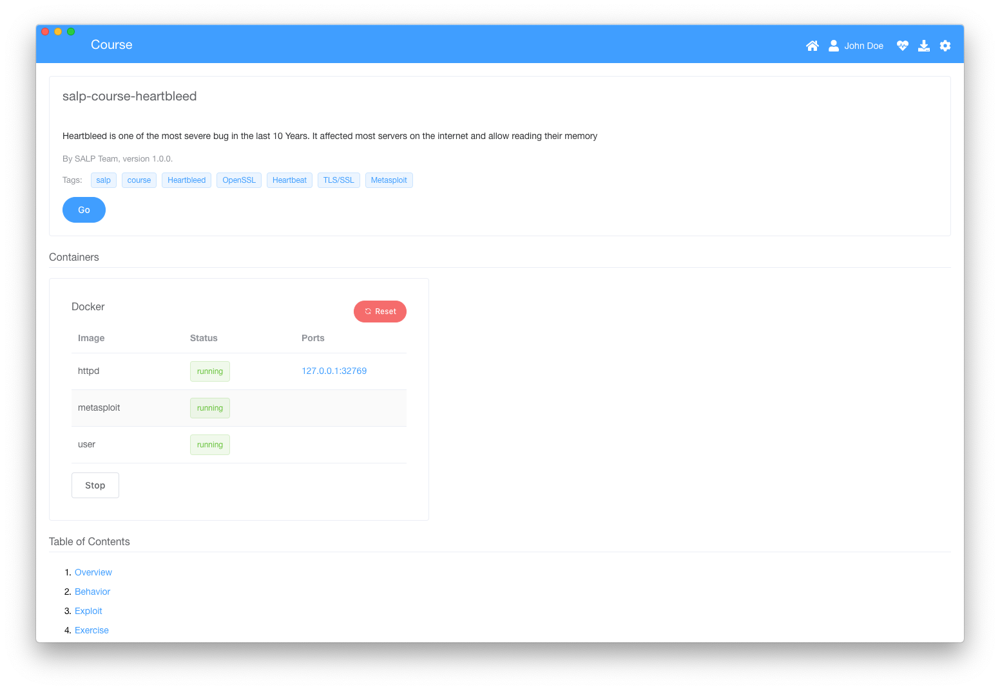

# salp [](https://lernajs.io/)
SALP (short for *Security Awareness Learning Platform*) is a cross-platform desktop application to teach security aspects in modern technology (mostly software) and thereby raise the general security awareness.

Because it has a native [Docker](https://www.docker.com/) integration, it ships with prepared demos to try out exploits.



## Project
This repository is a mono-repo managed with [lerna](https://lernajs.io/). It contains the following sub-packages:

| Path                             | Description                                                                               | License                                                                                                |
|----------------------------------|-------------------------------------------------------------------------------------------|--------------------------------------------------------------------------------------------------------|
| `core/application`               | Contains the main application logic and code for the electron main process.               | [Blue Oak Model License 1.0.0](./core/application/LICENSE)                                             |
| `core/frontend`                  | The Vue.js based frontend of the desktop application.                                     | [Blue Oak Model License 1.0.0](./core/frontend/LICENSE)                                                |
| `core/sandbox`                   | A special Vue.js application which sandboxes a course content.                            | [Blue Oak Model License 1.0.0](./core/course-sandbox/LICENSE)                                          |
| `packages/@salp/course-bundler`  | Webpack based build system for courses.                                                   | [Blue Oak Model License 1.0.0](./packages/@salp/course-bundler/LICENSE)                                |
| `packages/@salp/markdown-loader` | Webpack loader for compiling Markdown to Vue.js app with pre-configured content elements. | [Blue Oak Model License 1.0.0](./packages/@salp/markdown-loader/LICENSE)                               |
| `courses/salp-course-example`    | An example course structure.                                                              | [Dual licensed](./courses/salp-course-example/LICENSE) (Blue Oak Model License 1.0.0 and CC-BY-4.0)   |
| `courses/salp-course-heartbleed` | A course about the Heartbleed OpenSSL vulnerability.                                      | [Dual licensed](./courses/salp-course-heartbleed/LICENSE) (Blue Oak Model License 1.0.0 and CC-BY-4.0) |

## Development
After cloning this repo you can install all dependencies with npm:
```sh
npm install
```

Note that this may take some time initially because it also downloads the testing framework and electron binary.

### Serving the complete app
You can start the whole app by running:
```sh
npm run serve
```

This will build the courses, serves the frontend and the course-sandbox and starts the electron application. Because the Vue.js apps support hot-reloading you don't have to restart the app if you change anything of them. However if you change a course or the application code itself you need to restart the app.

### Build the app
Run the following command to build the complete app:
```sh
npm run build
```

Again this will take care of all packages.

## Documentation
You can find the current documentation in the `docs/` folder:
* [Documentation](./docs)

## Contribution
You are welcome to contribute to this project: Just open an issue or create a pull request.

## Acknowledgements
This project was inspired by [WebGoat](https://www.owasp.org/index.php/Category:OWASP_WebGoat_Project), a similar learning application.

Thanks to [Philipp Taplan](https://taplan.artstation.com/) for creating the logo.
